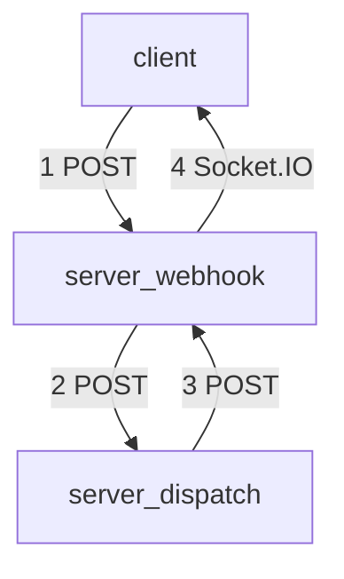

# Webhook + Socket.io

This is a simple example of how to use a webhook to send data to a client using socket.io.

## How to run
`npm run start`

## Architecture

```mermaid
graph TD;
    client -->|1 POST| server_webhook;
    server_webhook -->|2 POST| server_dispatch;
    server_dispatch -->|3 POST| server_webhook;
    server_webhook -->|4 Socket.IO| client;
```
